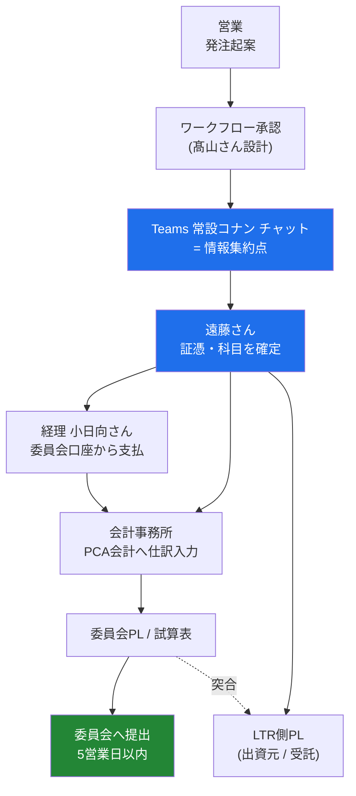
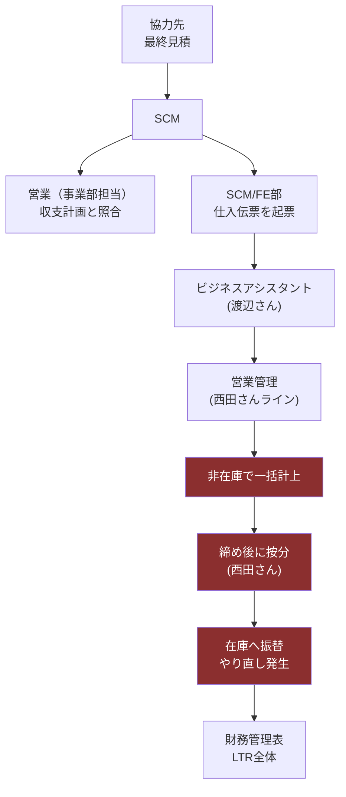
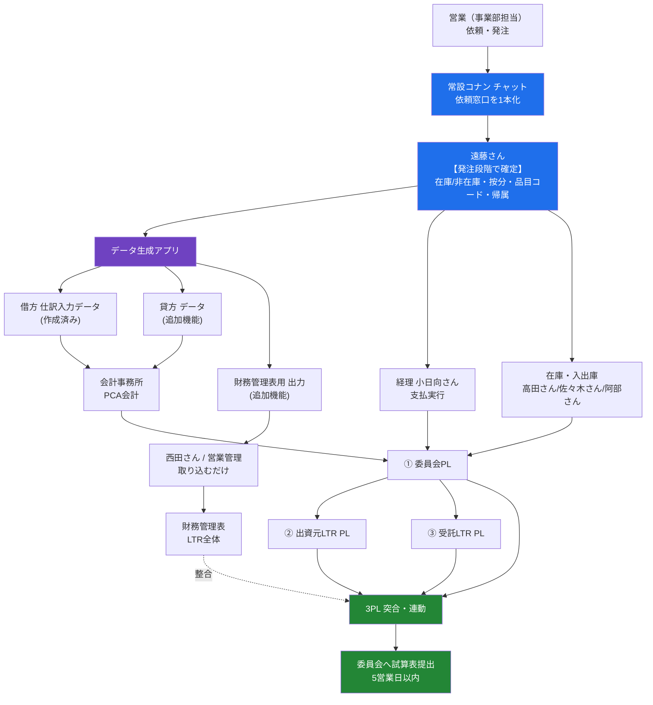
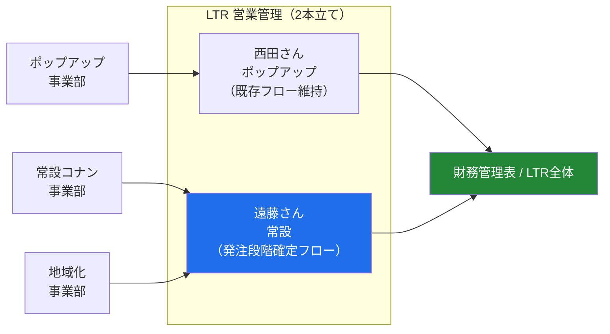
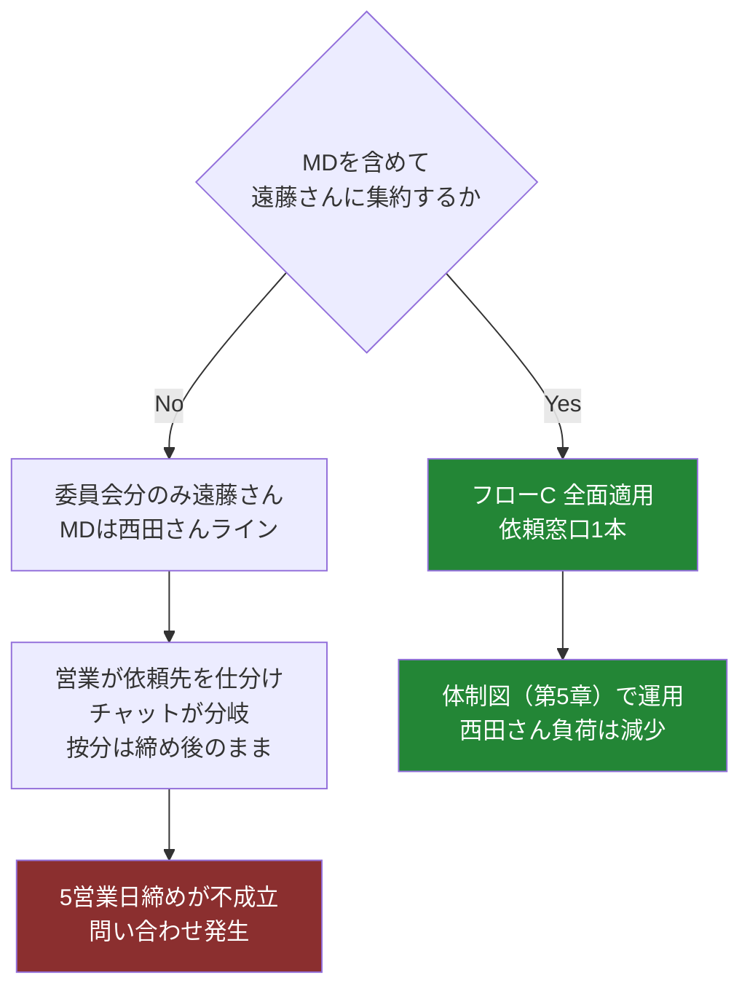

# 常設コナン 業務フロー（文章＋図解）

作成日：2026/8/5　／　根拠：7/23 すり合わせMTG・7/24 通話議事録＋遠藤さん追加方針

---

## 0. 前提となる構造

常設コナンは **ショープロ・東急レク・LTR の3社出資による委員会** で運営される。
そのため LTR 社内には**性格の違う3つのPL**が同時に存在し、これが全フローの設計条件になる。

| PL | 作成主体 | 内容 |
|----|----------|------|
| ① 委員会PL | 顧問会計事務所（PCA会計） | 委員会そのものの損益。委員会へ毎月試算表を提出（**5営業日**） |
| ② 出資元としてのLTR PL | LTR | 出資者としての持分・投資回収 |
| ③ 委託を受けるLTR PL | LTR | 委員会から委託された運営・物販（売上の20%を委員会に戻す／在庫リスクはLTR） |

**この3つを突合し、差異なく連動させることが遠藤さんの業務委託の目的**（山崎さん発言）。
→ 3つのPLが繋がるには、**入口（発注・支払い）の時点で正しい区分が付いている**必要がある。これがフロー設計の核心。

---

## 1. 登場人物と役割

| 担当 | 役割 |
|------|------|
| 営業（事業部担当） | 発注・依頼の起点。収支計画を持つ |
| 山崎さん | 常設事業部側の推進。委員会・社内調整 |
| **遠藤さん** | 情報集約ハブ。帳票作成、会計事務所連携、在庫・入出庫管理、データ／アプリ整備 |
| 髙山さん | ワークフロー・支払いスキームの設計 |
| 山口さん | LTR全体の締めの責任・権限（黒田さんの後任として一任） |
| 西田さん | 営業管理（既存フローの実務主管）。配下にビジネスアシスタント（渡辺さん等） |
| 小日向さん（経理） | 委員会口座からの支払い実行 |
| 会計事務所 | PCA会計への仕訳入力、委員会PL・試算表作成 |
| 高田さん・佐々木さん | 在庫管理連携 ／ 阿部さん：入出庫管理連携 |
| SCM | 協力先からの最終見積の受領・連携 |

---

## 2. フローA：委員会口座からの支払い【合意済み】

> 山口さん：「委員会の処理の流れは今めちゃめちゃ理解できて、**常設のチャットでやるのは超合理的**」「**全然アグリ**」

### 文章での説明

1. 営業が発注を起案する（初期投資・什器・書き下ろし費用など）。
2. **ワークフロー承認**（髙山さん設計）を通す。委員会の意思決定として承認を取る。
3. 承認後、**Teams の常設コナン専用チャット**に集約。ここに会計事務所も参加する。
4. 遠藤さんが **経理・小日向さん**と連携し、**委員会名義の銀行口座**から支払いを実行する。
   ※LTR口座ではないため、既存のLTRフローでは処理できない。
5. 遠藤さんが処理内容を **会計事務所へ報告・連携**（月末日〜第一営業日までに。証憑・勘定科目の指定を含む）。
6. 会計事務所が **PCA会計へ仕訳入力**。
7. 月次で試算表を作成し、**5営業日以内に委員会へ提出**。
8. 同じ数字を①②③のPL突合に回す。

### 図解

---

## 3. フローB：MD（物販原価）の現行フロー【山口さんが維持を主張】

### 文章での説明

1. 協力先から**最終見積**が出る。
2. SCM が受領し、**事業部担当（営業）**に「最終金額はこれでいく」と連携。営業は自分の収支計画に収まっているかを確認する。
   - ※**最終見積そのものと収支計画の突合は、最後は誰も確認していない**（山口さん認証）。金額合意は発注前にSCM–営業制作間で取られている前提。
3. SCM／FE部が**仕入伝票**を切り、**ビジネスアシスタント（渡辺さん）**へ依頼。
4. ビジネスアシスタントのフィルターを通って**営業管理（西田さんライン）**へ情報が流れる。
5. 営業管理が計上。**原価は一旦「非在庫」で一括計上**されることがあり、後から在庫へ振り替える。
6. 締め後に**西田さんが按分を対応**。
7. **財務管理表**（LTR全体の経営判断帳票）に集約される。

### 現行フローの課題（議事録で確認済み）

- 原価が**単月でドカンと乗り**、正しい事業判断ができない（山崎さん）。
- 按分が**締め後対応**のため、5営業日締めの委員会報告に間に合わない。
- 原価が単月で乗るため、**第5営業日までに正しい事業判断が確認できない見込み**。
- 金額ズレが発生すると**浦野さん→西田さんへの問い合わせ**が都度発生している。

### 図解

赤いブロックが**委員会報告と両立しない部分**。

---

## 4. フローC：提案フロー【遠藤さんへの集約】

### 考え方

現行フロー（フローB）を**壊さない**。
壊すのではなく、**「非在庫で切って後で直す」を「発注時点で確定させる」に前倒しする**だけ。
その前倒しを担う人として遠藤さんが入り、**西田さん・経理へは完成したデータを渡す**。

> 遠藤さん：「按分は現時点では締めが終わってからの対応を西田さんがされていると伺っているが、**その対応は踏まないというふうにやらなければならないので、発注の段階できちんとする処理を対応していくというフローに、コナンは変えていく予定**」

### 文章での説明

1. **営業からの依頼は常設コナンチャット1本**に集約する。
   - 営業が「これは委員会財布だから遠藤さん、これはMDだから西田さん」と**判断・仕分けする必要をなくす**。
   - 仕訳は遠藤さんが行う。
2. 遠藤さんが**発注段階で**下記を確定させる。
   - 在庫 / 非在庫の区分
   - 按分（固定費・共通費）
   - 品目コード
   - 委員会案件 / LTR案件の帰属
3. 確定した内容を各所へ**加工済みデータとして配布**する。
   - **西田さん・営業管理へ** … 取り込みたい形式のまま出力したデータを渡す。**日報のまとめは不要**。西田さん側は取り込むだけになる。
   - **会計事務所へ** … 仕訳入力データ（借方は**アプリで生成済み**、貸方は追加機能で対応可能）。
   - **経理へ** … 支払データ。
   - **委員会・ショープロ・東急レクへ** … 提出試算表。LTRとしての事業計画の進捗や推移も、全てのデータで見える化させ事業部が把握できる状態にする。
4. 在庫・入出庫は高田さん・佐々木さん・阿部さんと連携し、遠藤さん側で整合を取る。
5. 月次で①②③のPLを突合し、**5営業日以内**に試算表を委員会へ提出。
6. 帳票を見れば金額ズレの理由が分かる状態にし、**問い合わせ自体を発生させない**。

### 図解

### フローB との差分（＝提案の実体）

| 項目 | 現行（フローB） | 提案（フローC） |
|------|-----------------|-----------------|
| 経費の在庫/非在庫の判断 | 計上時に非在庫→後から振替 | **発注時に按分費用として発注。按分額も月内で払出**（金額は遠藤さんが計算・提示） |
| 按分 | 締め後に西田さんが対応 | **発注時に按分で処理**。遠藤さんが締めまでに費用の全てを計算し依頼 |
| 依頼窓口 | 営業が相手を判断して振り分け | **常設コナンチャット1本。全て遠藤さんが対応** |
| 西田さんの作業 | 伝票処理＋按分＋振替＋問い合わせ対応 | **受け取ったデータを取り込むだけ** |
| 日報 | まとめが必要 | **不要**（必要形式で出力して渡す） |
| 仕訳入力 | 手作業 | **アプリで自動生成**（借方完成／貸方・財管は追加対応） |
| 金額ズレ | 都度問い合わせ（浦野さん→西田さん） | **帳票で自己説明。問い合わせ不要** |

---

## 5. 体制図：西田さん＝ポップアップ／遠藤さん＝常設

山口さんが**唯一はっきり同意した集約の形**（「めっちゃいいと思います」「ベースは私も超アグリです」）。

**この形の利点（そのまま説明材料になる）**

- LTR全体としては窓口が2本だが、**事業部から見れば依頼先は常に1人**＝シンプル化。
- 「ワンオペになる」「マネジメントラインが複数になる」という山口さんの懸念が構造的に解消する。
- 実務ができる人が西田さん1人だった状態が2人になり、**西田さんの負荷が実際に下がる**。
- 緻密さが必要な常設・地域化と、既存フローで回るポップアップを**性質で分けられる**。

---

## 6. 月次スケジュール（5営業日締め）

> 発注段階で区分が確定していれば5営業日は成立する。
> 締め後に按分・振替を行う現行フローでは、この日程には入らない。
> ※東急レクさんからは「3営業日でも試算表が欲しい」という要望も出ている。

---

## 7. 議論の分岐点（次回の合意ポイント）

### 次回に持ち込むもの

1. **在庫／非在庫・按分の切り方ルール案（先出し）**
   山口さん：「**ルールだけ先に上げてもらいたい。切り方だけ合意形成が取れれば、それで切る**」
   → 相手が動く条件を本人が明示している。こちらからルール案を出せば進む。
2. **アプリのデモ**（借方仕訳入力データは会計事務所用に作成済み／貸方・財務管理表出力は追加機能で対応可能）
   → 「カフェは伝票の数が桁違い」という反対理由に対する直接の回答になる。
3. **第5章の体制図**（山口さん同意済みの案として提示）
4. **7月発生分の一覧**（ハイゼンレーン頭金＝7月末締め8月末払い、書き下ろし費用、サンプル費用、デザイン費、英文確認費など）※山口さんから確認依頼あり
5. **固定費按分ルール協議への参加**（地域化・成瀬くんと同時進行。山口さんから協力要請あり）
